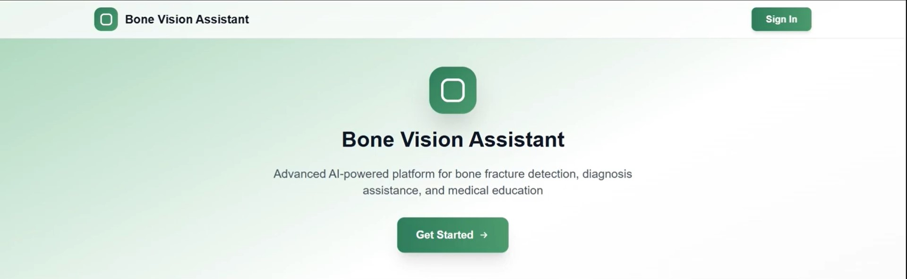
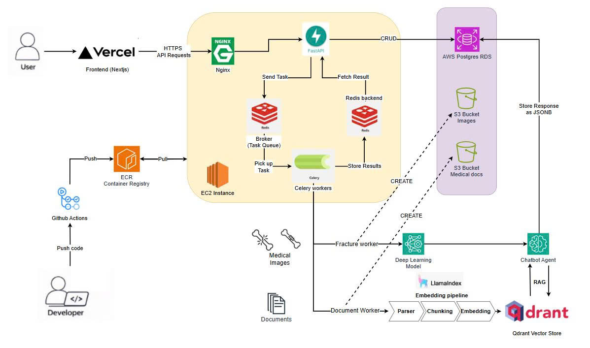
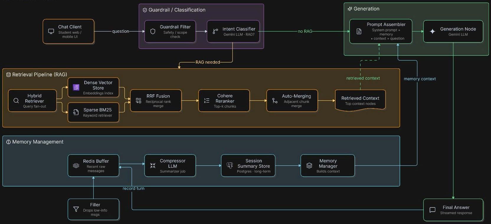

# FracturAInsight-Agent - Learn Fracture Diagnosis Through AI Assistant Platform


---

## 🎬 Demo Video

[](https://youtu.be/0D5_F5Vy9jU)
---

## 📋 Table of Contents

- [Overview](#overview)
- [Features](#features)
- [Architecture](#architecture)
- [Chatbot](#chatbot)
- [Tech Stack](#tech-stack)

---

## 🔍 Overview
A comprehensive web application for medical students to learn bone fracture detection through AI-assisted education. The platform combines interactive chatbot assistance, AI-powered fracture detection, and document-based learning with RAG (Retrieval Augmented Generation).


This platform bridges theoretical medical education with practical diagnostic skills:

- **Fracture Detection Engine**: YOLOv8 deep learning model trained on X-ray images for bone fracture identification
- **Conversational AI**: LangChain/LangGraph-based chatbot for medical Q&A and learning guidance
- **RAG System**: LlamaIndex pipeline with Qdrant vector store for document-enhanced responses
- **Learning Model**: Students annotate → AI predicts → System compares → Feedback provided
- **CI/CD Pipeline**: Fully automated testing, Docker image build, and deployment via GitHub Actions to AWS EC2

---

## ✨ Features

### Student Features
- **Interactive Chatbot**: Ask questions about bone fractures, treatments, and anatomy
- **Fracture Detection Practice**:
  - Upload X-ray images for analysis
  - Make your own fracture predictions
  - Compare your predictions with AI model results
  - Receive detailed feedback on accuracy
- **Document Upload & RAG**: Upload medical documents (PDF, DOCX) for context-aware chatbot responses

### Teacher Features
- Dashboard for monitoring student progress
- Administrative capabilities

---

## 🏗️ Architecture



---

## 💬 Chatbot

The chatbot answers student questions using a LangGraph pipeline with three steps:

1. **Classify** — decides if the question needs the knowledge base (RAG) or is just casual chat
2. **Retrieve** — if needed, runs hybrid search (dense + BM25) over the document store, fuses results with RRF, then reranks with Cohere
3. **Generate** — combines retrieved context and conversation memory to write the answer

Conversation memory is kept in Redis for recent turns, and older turns get summarized and stored so the chatbot stays aware of context without unbounded growth.

The pipeline is instrumented with **LangSmith** tracing, so every step (classify, retrieve, generate) is logged and can be inspected to catch bad outputs and debug the pipeline.



## 🛠️ Tech Stack

### Backend
- **FastAPI** — Python REST API framework
- **PostgreSQL** — primary relational database
- **Redis** — message broker for async task queue
- **Celery** — background task processing for AI workloads
- **SQLAlchemy + Alembic** — ORM and database migrations
- **PyTorch + YOLOv8** — bone fracture detection model
- **LangChain + LangGraph + LangSmith** — conversational AI and agent framework
- **LlamaIndex** — RAG pipeline for document processing
- **Qdrant** — vector database for document embeddings
- **AWS S3** — object storage for images and documents

### Frontend
- **Next.js 14** — React framework
- **TypeScript** — type-safe JavaScript
- **Tailwind CSS** — utility-first styling

### Infrastructure & DevOps
- **Docker** — containerisation
- **AWS EC2** — backend server
- **AWS RDS** — managed PostgreSQL
- **AWS ECR** — private Docker image registry
- **GitHub Actions** — CI/CD pipeline (test → build → deploy)
- **Nginx** — reverse proxy
- **Vercel** — frontend deployment

- [Installation](#installation)

## 🚀 Installation

### Prerequisites

- Python 3.11+
- Node.js 18+
- PostgreSQL 13+
- Redis
- Docker (optional)

### 1. Clone the repository

```bash
git clone https://github.com/minh-quan2811/bone-fracture-diagnosis-assistant.git
cd bone-fracture-diagnosis-assistant
```

### 2. Backend Setup

```bash
cd be
```

Create and activate a virtual environment:

```bash
python -m venv venv

# Mac/Linux
source venv/bin/activate

# Windows
venv\Scripts\activate
```

Install dependencies:

```bash
pip install -r requirements.txt
```

Configure environment variables:

```bash
cp .env.example .env
```

Edit `.env` with your values:


Run database migrations:

```bash
alembic upgrade head
```

Start the API server:

```bash
uvicorn main:app --reload --host 0.0.0.0 --port 8000
```

Start the Celery worker (separate terminal):

```bash
celery -A celery_app worker --loglevel=info -Q fracture_queue,document_queue,memory_queue --pool=solo
```

Backend is available at: http://localhost:8000
Swagger docs at: http://localhost:8000/docs

---

### 3. Frontend Setup

```bash
cd fe
```

Install dependencies:

```bash
npm install
# or
yarn install
# or
pnpm install
```

Configure environment variables:

```bash
cp .env.example .env.local
```

Edit `.env.local`:

```env
NEXT_PUBLIC_API_URL=http://localhost:8000
```

Start the development server:

```bash
npm run dev
# or
yarn dev
# or
pnpm dev
```

Frontend is available at: http://localhost:3000

---

### 4. Running with Docker (For Backend)

From the `be/` directory:

```bash
docker compose up --build
```

To run in the background:

```bash
docker compose up --build -d
```

View logs:

```bash
docker compose logs -f
```

Stop all containers:

```bash
docker compose down
```